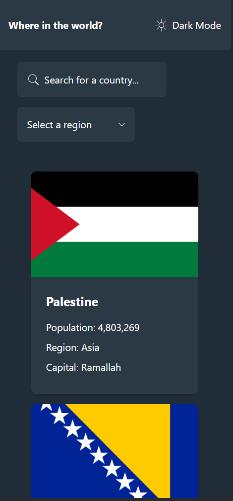
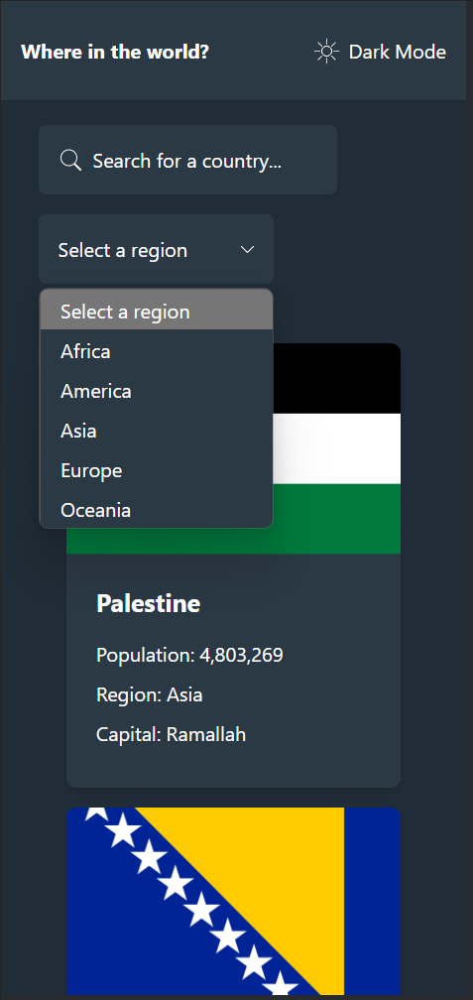
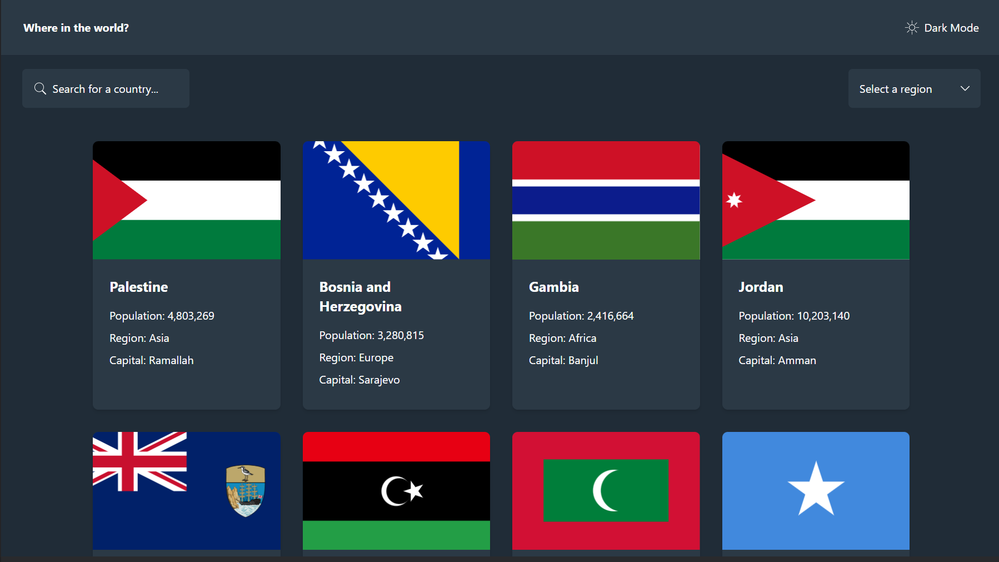
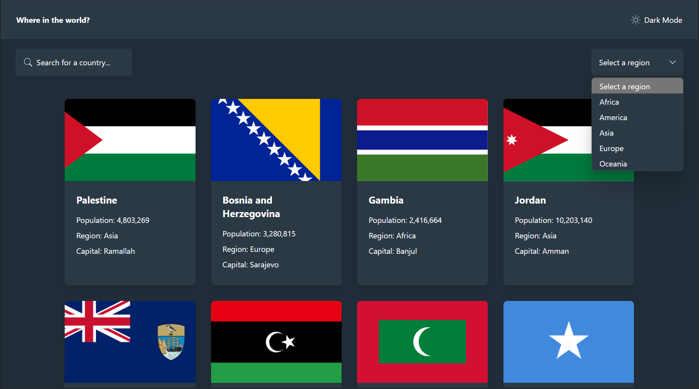

# Frontend Mentor - REST Countries API with color theme switcher

This is a solution to the [REST Countries API with color theme switcher challenge on Frontend Mentor](https://www.frontendmentor.io/challenges/rest-countries-api-with-color-theme-switcher-5cacc469fec04111f7b848ca).This project was developed in React, it is a Frontend Mentor challenge, it allows searching and filtering countries through an API, this application has a dark and light mode.

## 🧐 What's inside?

This Starter includes

- ⚡️ [Next.js 12](https://nextjs.org/) - The React Framework for Production
- ⚛️ [React 18](https://reactjs.org/) - A JavaScript library for building user interfaces
- 🧁 [TailwindCSS v3](https://tailwindcss.com/) - A utility-first CSS framework packed with classes
- ✨ [TypeScript](https://www.typescriptlang.org/) - TypeScript is a strongly typed programming language that builds on JavaScript, giving you better tooling at any scale.
- 🎉 [Sass](https://sass-lang.com/) - Sass is the most mature, stable, and powerful professional grade CSS extension language in the world.
- 📏 [ESLint](https://eslint.org/) — Find and fix problems in your JavaScript code.
- 🦋 [Prettier](https://prettier.io/) — An opinionated code formatter.
- 🐶 [Husky](https://github.com/typicode/husky) - Husky improves your commits and more 🐶 woof!
- 🐶 [Lint Staged](https://github.com/okonet/lint-staged) — Run linters against staged git files and don't let 💩 slip into your code base!

## Overview

## 🚀 Getting Started

```
# Install dependencies

npm install
# or
yarn install

# Start development server

yarn dev
# or
npm run dev

# Build for production

yarn build
# or
npm run build
```

### The challenge

Users should be able to:

- See all countries from the API on the homepage

- Search for a country using an input field

- Filter countries by region

- Click on a country to see more detailed information on a separate page

- Click through to the border countries on the detail page

- Toggle the color scheme between light and dark mode (optional)

### Screenshot









### Links

- Solution URL: [Link to solution URL here](https://www.frontendmentor.io/solutions/rest-countries-api-with-color-theme-switcher-PEPrHnrjaL)
- Live Site URL: [Link to live site](https://countries-api-test.netlify.app/)

## Author

- Frontend Mentor - [@Georgeb79](https://www.frontendmentor.io/profile/Georgeb779)
- Linkedin - [@GeorgeBaez](https://www.linkedin.com/in/george-baez/)
- Twitter - [@Georgeb779](https://twitter.com/Georgeb779)
